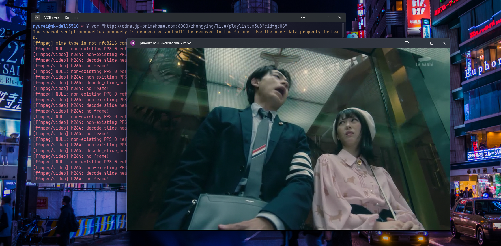

# Scripts and Dolphin Services

This repo contains scripts and KDE Dolphin services made by me.

## Scripts

### vcr



Play a video stream in mpv while recording automatically.

#### How to use?

Simply type the url of the video stream after the command.

```
$ vcr "http://stream.url/main.m3u8"
```

It'll then start recording while playing back the stream, saving it in the VCR directory in the videos directory of your OS.

- On Linux it will be saved to: /home/$USER/Videos
- On Windows it will be saved to: C:\\Users\\$USER\Videos

#### Dependecies:

- mpv
- ffmpeg

## Dolphin Services

### convert_images

Quickly convert image files into jpeg, png, webp or jxl.

#### Dependecies:

- imagemagick

## Setup

### Quick Setup

#### Linux

```
$ ./install.sh
```

#### Windows

#TODO

### Manual Setup

#### Linux

Scripts should be placed in the **~/.local/bin** directory.

Dolphin services should be placed in the following directories:

- **Plasma 6:** ~/.local/share/kio/servicemenus

- **Plasma 5:** ~/.local/share/kservices5/ServiceMenus

#### Windows

#TODO

## License

This project is licensed under the __BSD 3-Clause License__ - See the [LICENSE](./LICENSE) file for more details.
